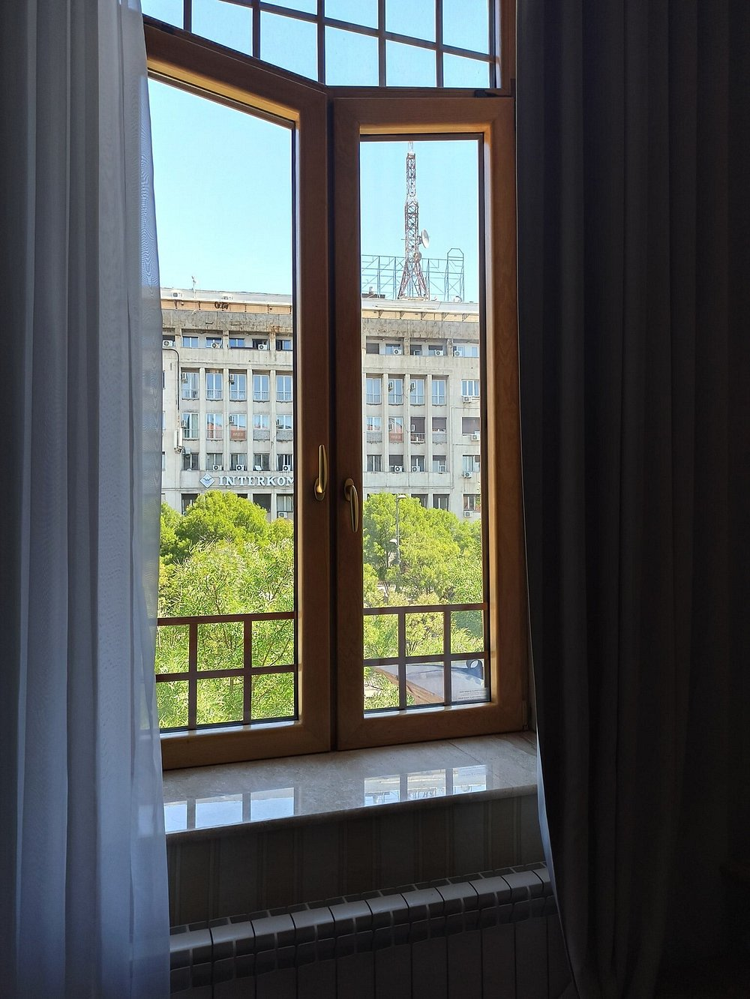
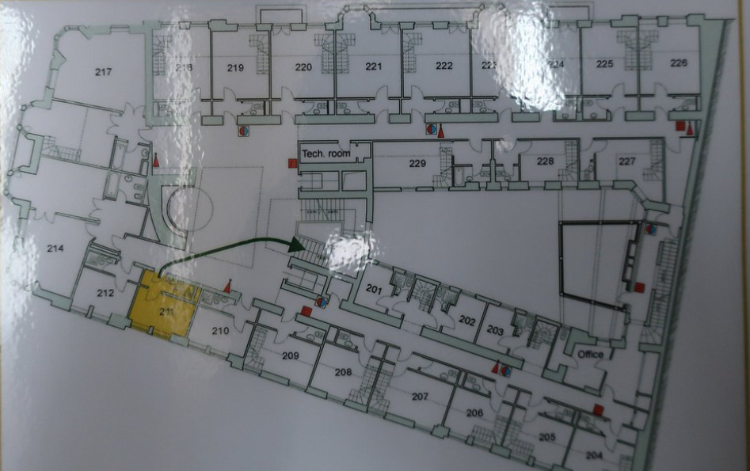

Here are All the OSINT challenges SOLVED


# The Fall

## 1

`If so, type "I am ready"`

**Flag:** `I am ready`

## 2

Base64: `Y25kZ3Zrc2RrY2dzbGpnbWJqb3ZnaVNob3VsZHdlZG9pdGR1cmluZ3NsYXZhb3JzaG91bGR3ZXdhaXRhbm90aGVyd2Vlaz9mZGdza2hiZG52Y2xkbWlrZ292bg==`

Decodes to:  
`cndgvksdkcgsljgmbjovgiShouldwedoitduringslavaorshouldwewaitanotherweek?fdgskhbdnvcldmikgovn`

Extracted phrase: `Should we do it during slava or should we wait another week?`

`Slava` is a Serbian religious/family celebration.

**Flag:** `Serbia`

## 3

From the screenshot, extract username `yahav1w` and search it on Steam Community:  
<https://steamcommunity.com/search/users/#text=yahav1w>

Look at reviews: <https://steamcommunity.com/profiles/76561199007468581/recommended/>  
Find the matching review.

**Flag:** `Scorn`

## 4

Run this Shodan query: `country:RS has_vuln:true`

Open **View Report** and check the top vulnerabilities entry. At the time of writing, it is `SMBv3 Remote Code Execution` with 350.

**Flag:** `cve-2020-0796`

## 5

Use this Google dork: `site:exploit-db.com "CVE-2020-0796" +"RCE" + "SMBghost"`

Top entry: <https://www.exploit-db.com/exploits/48537>

Download file and use [CyberChef](https://gchq.github.io/CyberChef/) to check MD5.

**Flag:** `a72af5d31185650bc5312248ade8bd73`

## 6

Do a reverse image search on the `wowYasser` image:


This gives the hotel name: `Hotel Moskva`.

To locate the room number:



We see a building called `Interkom`.

[Here it is on Google Maps](https://www.google.com/maps/place/Hotel+Moskva/@44.8129878,20.4610167,3a,60y,272.83h,98.61t/data=!3m7!1e1!3m5!1sci_PRq-piS9O2pZRsvUy4g!2e0!6shttps:%2F%2Fstreetviewpixels-pa.googleapis.com%2Fv1%2Fthumbnail%3Fcb_client%3Dmaps_sv.tactile%26w%3D900%26h%3D600%26pitch%3D-8.612269992356175%26panoid%3Dci_PRq-piS9O2pZRsvUy4g%26yaw%3D272.8326880959936!7i13312!8i6656!4m10!3m9!1s0x475a7ab209cff051:0x52504f6400d4b777!5m3!1s2026-05-03!4m1!1i2!8m2!3d44.8130277!4d20.4604305!16zL20vMGNfaGIy?entry=ttu&g_ep=EgoyMDI2MDQyOS4wIKXMDSoASAFQAw%3D%3D)

According to the floor plan and this YouTube [video](https://youtu.be/MEcdvV7Aen0?si=rSCn_HmAl7AMLHLI):



Room 211 appears on the opposite end of the same floor from where the photo was taken. Examining the surroundings further:


According to the floor plan, the room is either 218 or 219. I chose 218 because it aligns better with the Interkom building in the photo, and the tree obstructions also match Street View.

**Flag:** `Hotel Moskva-218`

# Among The Stars

## 1

Source: <https://science.nasa.gov/exoplanet-catalog/2mass-j01033563-5515561-ab-b/>

**Flag:** `2MASS J01033563-5515561 AB b`

## 2

Source: <https://exoplanets.mickael-outhier.fr/>

**Flag:** `Paranal Observatory`

## 3

Search for Paranal Observatory and use: <https://www.eso.org/public/teles-instr/paranal-observatory/>


**Flag:** `3 km`

# Coffee Shop

## 1

Reverse image search result:

```text
This is an interior view of The Wee Coffee Shop in Blairgowrie, Scotland, featuring a window looking out toward The Edinburgh Woolen Mill across the street.

- Location: 1 Allan Street, Blairgowrie, Perth and Kinross, PH10 6AB, United Kingdom.
- Atmosphere: A family-run, dog-friendly establishment known for its cozy atmosphere and hearty food.
- Menu: The cafe serves breakfast, lunch, and a variety of freshly made sandwiches
```

**Flag:** `Blairgowrie`

## 2

**Flag:** `Allan Street`

## 3

Look at Google Maps of the shop.

**Flag:** `+447878839128`
