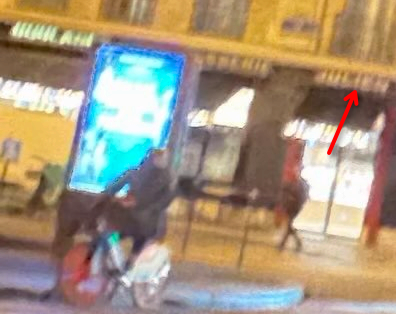
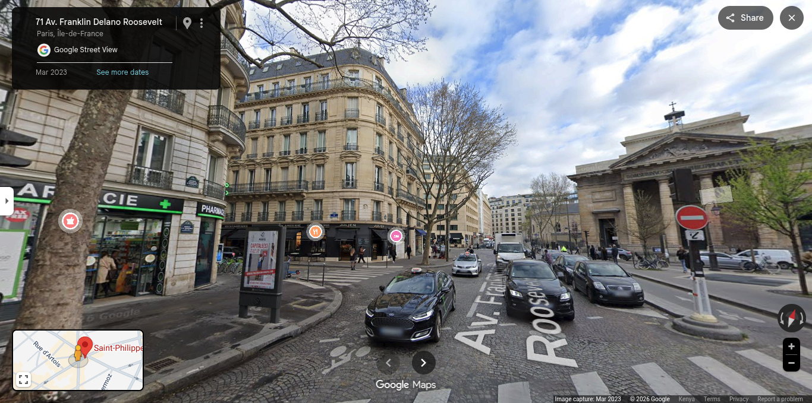

```
A photograph was taken in Paris on December 3rd, 2023, around 18:00.  
Your mission is to **identify the nearest metro station** to the location where the masked man was photographed.

This challenge focuses on applying GEOINT and OSINT techniques to analyze urban structure, lighting conditions, environmental clues, and the layout of Parisian transportation infrastructure.

## Context

Investigators received an image showing a masked individual standing in a central and upscale district of Paris.  
The metadata and environmental observations indicate:

- The image was taken on **December 3rd, 2023**
- The approximate time was **18:00** (early evening)
- The location is in **Paris**, within a **central and upscale area**
- The scene is located near the intersection of **a Rue** and **an Avenue**

Your objective is to determine **the closest metro station** to the photographed location, using only the contextual and visual clues provided.

## Mission

Analyze the given information and identify the nearest Paris metro station.  
The final answer must follow a strict flag format.

## Flag Format

**The flag is simply the name of the nearest metro station to the scene.**

Participants must submit the flag exactly like this:


OSINT{STATION_NAME}
```

## Solve
In the image a shop name is clear


Searching for `Julien Shop Paris` returns one with this address `73 avenue Franklin Delano Roosevelt, 75008 Paris France`

Visiting To confirm if its correct we get


The Building , signboard , round about and shop name match.

Zoom out look for a nearby metro station and you get `Saint-Philippe du Roule`

